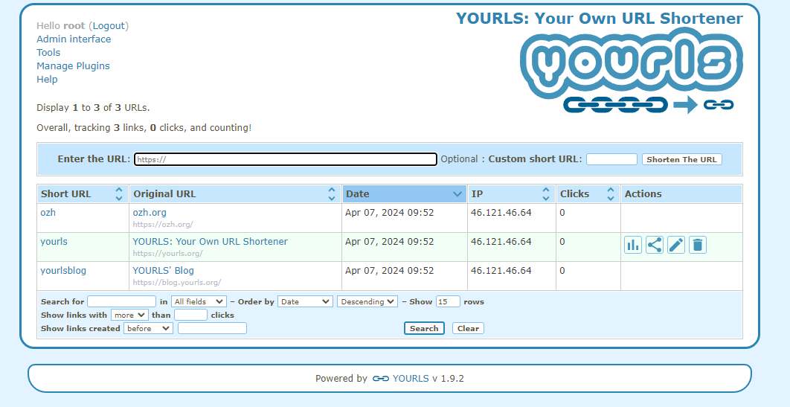

# Yourls CI/CD pipeline

Deploy Yourls server with CI/CD on Elestio

 
 

# Once deployed ...

You can open Yourls ADMIN UI here:

    URL: https://[CI_CD_DOMAIN]/admin
    login: "root"
    password: [ADMIN_PASSWORD]

# Once deployed ...

You can open Yourls ADMIN UI here:

    URL: https://[CI_CD_DOMAIN]:46454
    login: "root"
    password: [ADMIN_PASSWORD]
